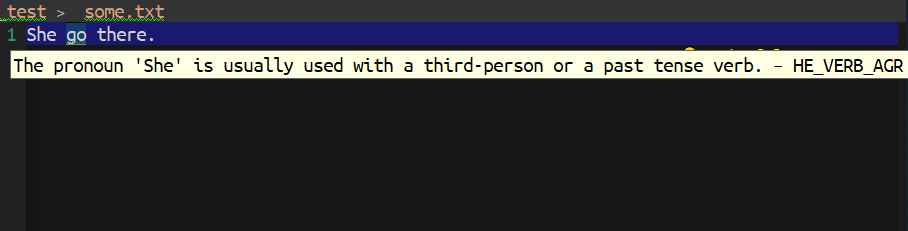

[](https://www.gnu.org/licenses/gpl-3.0)
[](https://melpa.org/#/lsp-ltex)
[](https://stable.melpa.org/#/lsp-ltex)


# lsp-ltex
> LSP Clients for LTEX

[](https://github.com/emacs-languagetool/lsp-ltex/actions/workflows/test.yml)
[](https://github.com/emacs-languagetool/lsp-ltex/actions/workflows/activate.yml)

`lsp-mode` client leveraging [LTEX Language Server](https://github.com/valentjn/ltex-ls).

<p align="center"></p>

## 💾 Quickstart

```el
(use-package lsp-ltex
  :ensure t
  :hook (text-mode . (lambda ()
                       (require 'lsp-ltex)
                       (lsp)))  ; or lsp-deferred
  :init
  (setq lsp-ltex-version "15.2.0"))  ; make sure you have set this, see below
```

For `lsp-ltex` to run you need to have `ltex-ls` installed and available.
Go to https://valentjn.github.io/ltex/ltex-ls/installation.html, download
the appropriate version, uncompress, and place it under `~/.emacs.d/.cache/lsp/ltex-ls`
. As explained there, if you download the archive that corresponds to
your platform, no Java installation is needed. If you use the platform-independent
file, you will need Java in your computer and you will need to set the JAVA_HOME
environment variable.

In the configuration for `lsp-ltex` you will probably want to set the version
you want to use; for example `(setq lsp-ltex-version "15.2.0")` in the `init`
section of `use-package`.

## 📇 Commands

| Commands            | Description                                           |
|:--------------------|:------------------------------------------------------|
| lsp-ltex-upgrade-ls | Upgrade LTEX server, if not found install it instead. |

## 🔧 Configuration

`lsp-ltex` supports following configuration. Each configuration is described in
detail in [LTEX Settings](https://valentjn.github.io/vscode-ltex/docs/settings.html).

* [`ltex.enabled`](https://valentjn.github.io/ltex/settings.html#ltexenabled) via `lsp-ltex-enabled`
* [`ltex.language`](https://valentjn.github.io/ltex/settings.html#ltexlanguage) via `lsp-ltex-language`
* [`ltex.dictionary`](https://valentjn.github.io/ltex/settings.html#ltexdictionary) via `lsp-ltex-dictionary`
* [`ltex.disabledRules`](https://valentjn.github.io/ltex/settings.html#ltexdisabledrules) via `lsp-ltex-disabled-rules`
* [`ltex.enabledRules`](https://valentjn.github.io/ltex/settings.html#ltexenabledrules) via `lsp-ltex-enabled-rules`
* [`ltex.hiddenFalsePositives`](https://valentjn.github.io/ltex/settings.html#ltexhiddenfalsepositives) via `lsp-ltex-hidden-false-positives`
* [`ltex.bibtex.fields`](https://valentjn.github.io/ltex/settings.html#ltexbibtexfields) via `lsp-ltex-bibtex-fields`
* [`ltex.latex.commands`](https://valentjn.github.io/ltex/settings.html#ltexlatexcommands) via `lsp-ltex-latex-commands`
* [`ltex.latex.environments`](https://valentjn.github.io/ltex/settings.html#ltexlatexenvironments) via `lsp-ltex-latex-environments`
* [`ltex.markdown.nodes`](https://valentjn.github.io/ltex/settings.html#ltexmarkdownnodes) via `lsp-ltex-markdown-nodes`
* [`ltex.additionalRules.enablePickyRules`](https://valentjn.github.io/ltex/settings.html#ltexadditionalrulesenablepickyrules) via `lsp-ltex-additional-rules-enable-picky-rules`
* [`ltex.additionalRules.motherTongue`](https://valentjn.github.io/ltex/settings.html#ltexadditionalrulesmothertongue) via `lsp-ltex-mother-tongue`
* [`ltex.additionalRules.languageModel`](https://valentjn.github.io/ltex/settings.html#ltexadditionalruleslanguagemodel) via `lsp-ltex-additional-rules-language-model`
* [`ltex.additionalRules.neuralNetworkModel`](https://valentjn.github.io/ltex/settings.html#ltexadditionalrulesneuralnetworkmodel) via `lsp-ltex-additional-rules-neural-network-model`
* [`ltex.additionalRules.word2VecModel`](https://valentjn.github.io/ltex/settings.html#ltexadditionalrulesword2vecmodel) via `lsp-ltex-additional-rules-word-2-vec-model`
* [`ltex.languageToolHttpServerUri`](https://valentjn.github.io/ltex/settings.html#ltexlanguagetoolhttpserveruri) via `lsp-ltex-languagetool-http-server-uri`
* [`ltex.languageToolOrg.username`](https://valentjn.github.io/ltex/settings.html#ltexlanguagetoolorgusername) via `lsp-ltex-languagetool-org-username`
* [`ltex.languageToolOrg.apiKey`](https://valentjn.github.io/ltex/settings.html#ltexlanguagetoolorgapikey) via `lsp-ltex-languagetool-org-api-key`
* [`ltex.ltex-ls.path`](https://valentjn.github.io/ltex/settings.html#ltexltex-lspath) via `lsp-ltex-ls-path`
* [`ltex.ltex-ls.logLevel`](https://valentjn.github.io/ltex/settings.html#ltexltex-lsloglevel) via `lsp-ltex-log-level`
* [`ltex.java.path`](https://valentjn.github.io/ltex/settings.html#ltexjavapath) via `lsp-ltex-java-path`
* [`ltex.java.initialHeapSize`](https://valentjn.github.io/ltex/settings.html#ltexjavainitialheapsize) via `lsp-ltex-java-initial-heap-size`
* [`ltex.java.maximumHeapSize`](https://valentjn.github.io/ltex/settings.html#ltexjavamaximumheapsize) via `lsp-ltex-java-maximum-heap-size`
* [`ltex.sentenceCacheSize`](https://valentjn.github.io/ltex/settings.html#ltexsentencecachesize) via `lsp-ltex-sentence-cache-size`
* [`ltex.completionEnabled`](https://valentjn.github.io/ltex/settings.html#ltexcompletionenabled) via `lsp-ltex-completion-enabled` (currently, not implemented)
* [`ltex.diagnosticSeverity`](https://valentjn.github.io/ltex/settings.html#ltexdiagnosticseverity) via `lsp-ltex-diagnostic-severity`
* [`ltex.checkFrequency`](https://valentjn.github.io/ltex/settings.html#ltexcheckfrequency) via `lsp-ltex-check-frequency`
* [`ltex.clearDiagnosticsWhenClosingFile`](https://valentjn.github.io/ltex/settings.html#ltexcleardiagnosticswhenclosingfile) via `lsp-ltex-clear-diagnostics-when-closing-file`
* [`ltex.statusBarItem`](https://valentjn.github.io/ltex/settings.html#ltexstatusbaritem) via `lsp-ltex-status-bar-item` (currently, not implemented)
* [`ltex.trace.server`](https://valentjn.github.io/ltex/settings.html#ltextraceserver) via `lsp-ltex-trace-server`

## Contribute

[](http://makeapullrequest.com)
[](https://github.com/bbatsov/emacs-lisp-style-guide)
[](https://www.paypal.me/jcs090218)
[](https://www.patreon.com/jcs090218)

If you would like to contribute to this project, you may either
clone and make pull requests to this repository. Or you can
clone the project and establish your own branch of this tool.
Any methods are welcome!
